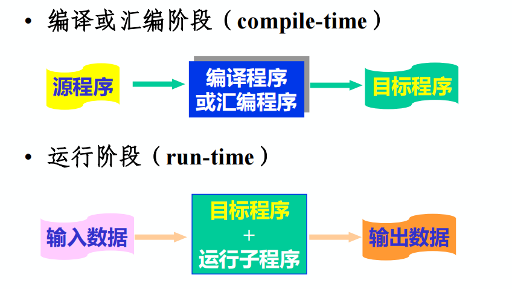
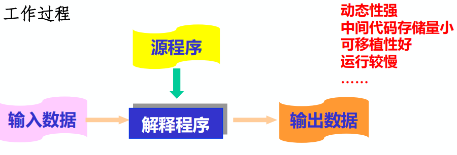
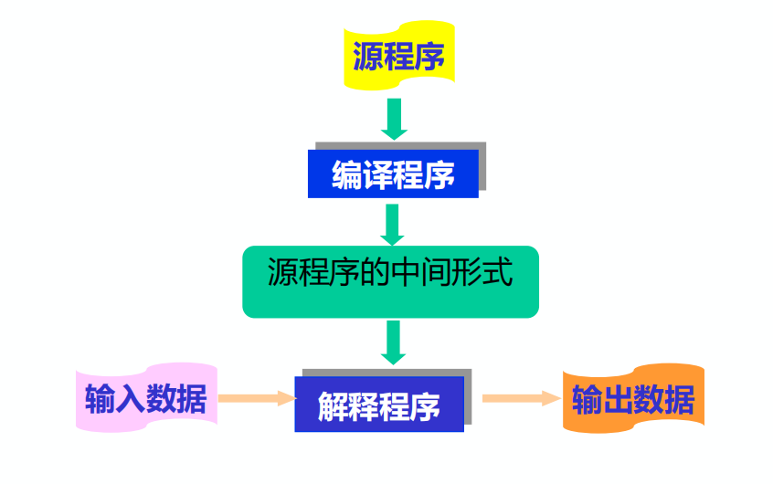
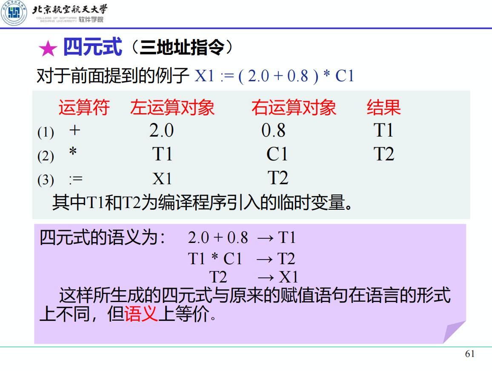
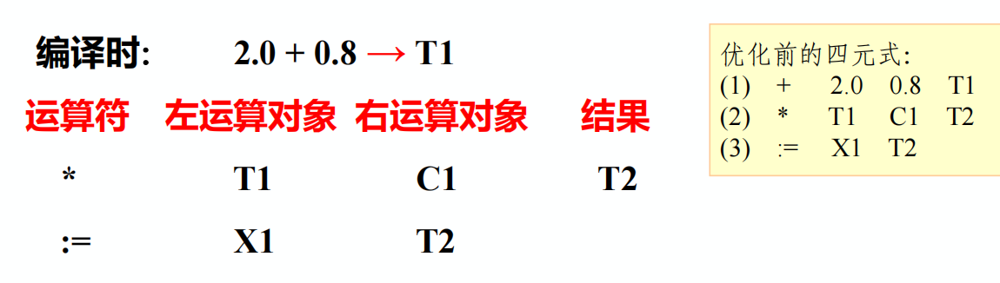
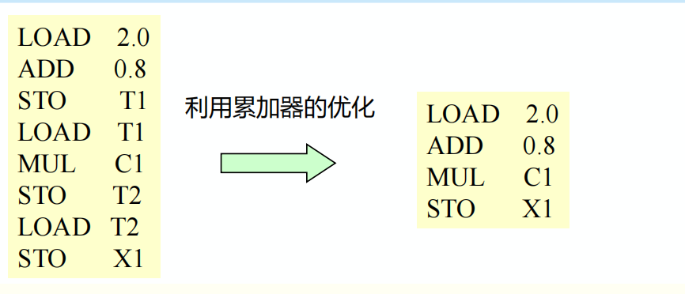
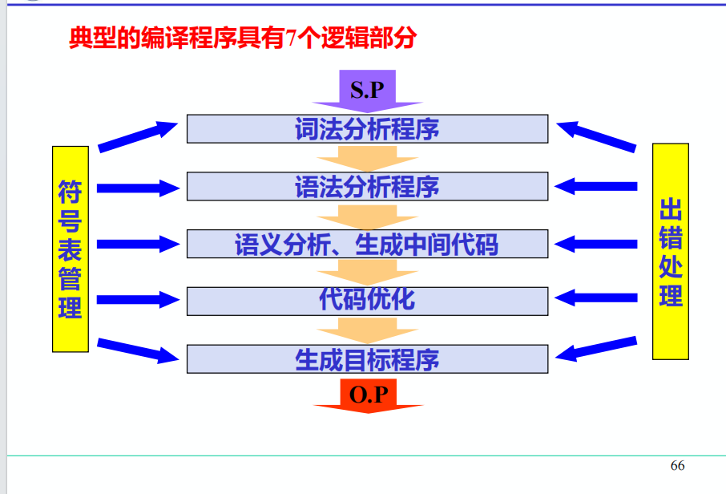
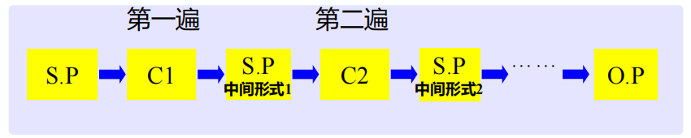
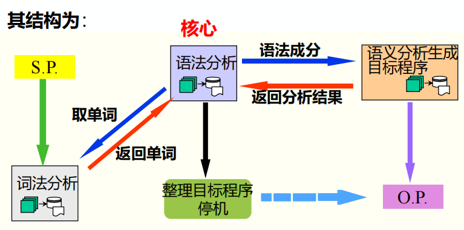
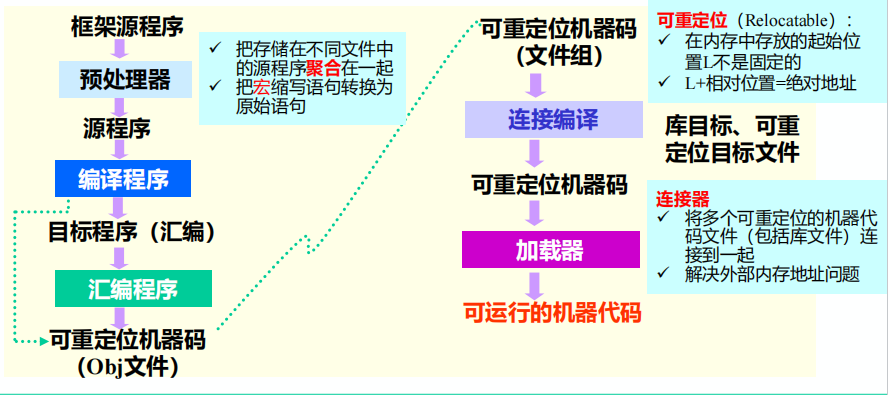

# 


要点总结：

* 编译的起源
* 概念：源程序 目标程序 翻译程序 汇编程序 编译程序
* 编译过程：5个基本阶段
* 编译程序：7个逻辑部分
* 遍、前端、后端、前后处理器

# 一、基本概念

## 1.1 机器语言

裸机能够识别和执行的语言

* 可读性差，人难以理解
* 编码容易出错
* 可维护性差

## 1.2 汇编语言

功能与机器语言基本相同，将二进制码符号化

* 引入助记符，符号化的机器语言
* 可读性提升
* 需要理解底层硬件原理，哪些是通用寄存器、哪些是特征寄存器、内存、数据区、指令区
* 对用户要求高

## 1.3 高级语言

C、C++、Python、Java等

## 1.4 源程序

用汇编语言或高级语言编写的程序

## 1.5 目标程序

用目标语言所表示的程序

## 1.6 目标语言

可以是介于源语言和机器语言之间的“中间语言”，可以是某种机器的机器语言，也可以是某种机器的汇编语言

## 1.7 翻译程序

将源程序转换为目标程序的程序称为翻译程序，它是指各种语言的翻译器，包括==汇编程序==和==编译程序==，是汇编程序、编译程序以及各种变换程序的总称

```text
源程序是翻译程序的输入，目标程序是翻译程序的输出
```

## 1.8 汇编程序

若源程序用汇编语言书写，经过翻译程序得到用机器语言表示的程序，这时的翻译程序就是汇编程序

## 1.9 编译程序

若源程序是用高级语言书写，经加工后得到目标程序

> [!CAUTION]
>
> 汇编程序与编译程序都是翻译程序，主要区别是加工对象的不同，由于汇编语言格式简单，常与机器语言之间有一一对应的关系，所以汇编程序所要做的翻译工作比编译程序简单得多

## 1.10 源程序的编译和运行



## 1.11 解释程序

对源程序进行解释执行的程序



## 1.12 编译-解释执行系统



## 1.13 编译过程

```text
词法分析->语法分析->语义分析、生成中间代码->代码优化->生成目标程序
```

### 1.13.1 词法分析

> [!IMPORTANT]
>
> 任务：分析和识别单词

源程序是由字符序列构成的，词法分析扫描源程序，根据语言的词法规则分析并识别单词及其类型，并以某种编码形式输出

> [!IMPORTANT]
>
> 单词：是语言的基本语法单位，一般语言有四大类单词

### 1.13.2 语法分析

> [!IMPORTANT]
>
> 任务：根据语法规则，分析并识别出各种语法成分，如表达式、各种说明、各种语句、过程、函数、程序等，并进行语法正确性检查

### 1.13.3 语义分析、生成中间代码

> [!IMPORTANT]
>
> 任务：对识别出的各种语法成分进行语义分析，并产生相应的中间代码

* 收集标识符的属性信息：种属、类型、存储位置、长度、值、作用域、参数和返回值类型

* 语义检查：
    * 变量或过程未经声明就使用
    * 变量或过程名重复声明
    * 运算分量类型不匹配
    * 操作符与操作数之间的类型不匹配

* 中间代码：一种介于源语言和目标语言之间的中间语言形式
* 生成中间代码的目的：
    * 便于做优化处理
    * 便于编译程序的移植
* 中间代码的形式：编译程序设计者可以自己设计，常用的有四元式、三元式、逆波兰表示等



### 1.13.4 代码优化

> [!IMPORTANT]
>
> 任务：目的是为了得到高质量的目标程序

例如：上面的四元式中第一个四元式是计算常量表达式值，该值在编译时就可以算出并存放在临时变量中，不必生成目标指令来计算，优化后：



### 1.13.5 生成目标程序

> [!IMPORTANT]
>
> 由中间代码很容易生成目标程序。这部分工作与机器关系密切，所以要根据具体机器进行，在做这部分工作时要注意充分利用累加器，也可以进行优化处理



## 1.14 编译程序构造

### 1.14.1 编译程序的逻辑结构

  按逻辑功能不同，可将编译过程划分为五个基本阶段，与此相对应，我们将实现整个编译过程的编译程序划分为五个逻辑阶段

```text
词法分析程序->语法分析程序->语义分析生成中间代码->代码优化程序->生成目标程序
```

在上述五个阶段中都要做两件事：

1. 建表和查表
2. 出错处理

* 表格管理：把源程序中的信息和编译过程中所产生的信息登记在表格中，而在随后的编译过程中同时又要不断地查找这些表格中地信息
* 出错处理：诊察出错误，并向用户报告错误性质和位置，以便用户修改源程序。出错处理能力的优劣是衡量编译程序质量好坏的一个重要指标

> [!IMPORTANT]
>
> 典型的编译程序具有7个逻辑部分



### 1.14.2 遍(PASS)

  遍：对源程序(包括源程序中间形式)从头到尾扫描一次，并做有关的加工处理，生成新的源程序中间形式或目标程序，通常称之为一遍。



> [!IMPORTANT]
>
> 注意遍与基本阶段的区别
>
> 五个基本阶段：是将源程序翻译作为目标程序在逻辑上要完成的工作
>
> 遍：是指完成上述五个基本阶段工作，要经过几次扫描处理

==一遍扫描编译程序==：一遍扫描即可完成整个编译工作

其结构为：



### 1.14.3 前端和后端

根据编译程序各部分功能，将编译程序分成前端和后端

==前端==：通常是与源程序有关的编译部分，词法分析、语法分析、语义分析、中间代码生成、代码优化——分析部分

==后端==：与目标机有关的部分。目标程序生成(与目标机有关的优化)——综合部分

### 1.14.4 编译程序的前后处理器

==源程序==：多文件、宏定义和宏调用。包含文件

==目标程序==：一般为汇编程序或可重定位的机器代码



## 1.15 编译技术的应用

### 1.15.1 程序理解工具

辅助理解别人写的程序

* 提取有价值的信息，展示给用户，辅助用户理解软件
* 准确提取的前提是设计自动分析软件，提供分析能力，进而准确分析

### 1.15.2 软件逆向工程工具

分析抽象，获取软件体系结构

* 逆向抽取模块设计，模块间接口
* 理解软件架构设计，功能划分、模块调用关系
* 维护现有软件
* 二次开发新软件

### 1.15.3 软件错误定位工具

定位到有缺陷的程序语句

* 提升开发效率

  输入：软件系统源码+一组测试，至少一个没有通过

  输出：一个可能有错误的程序元素列表，根据出错概率排序

### 1.15.4 软件自动修复工具

修复有缺陷的工具

* 提升开发效率

  输入：一个程序和其正确性约束，并且程序不满足正确性约束

  输出：一个补丁，可以使程序满足约束

### 1.15.5 软件自动补全工具

补全不完整的代码

* 提升开发效率

  基于智能化技术

  简单的语句补全

  API自动补全
