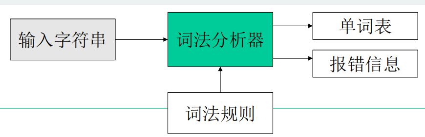
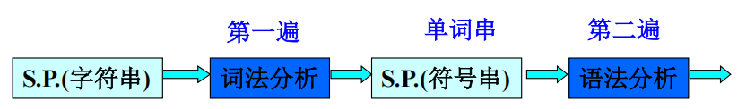
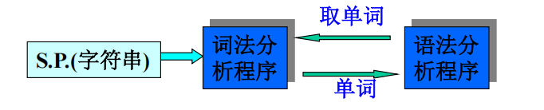
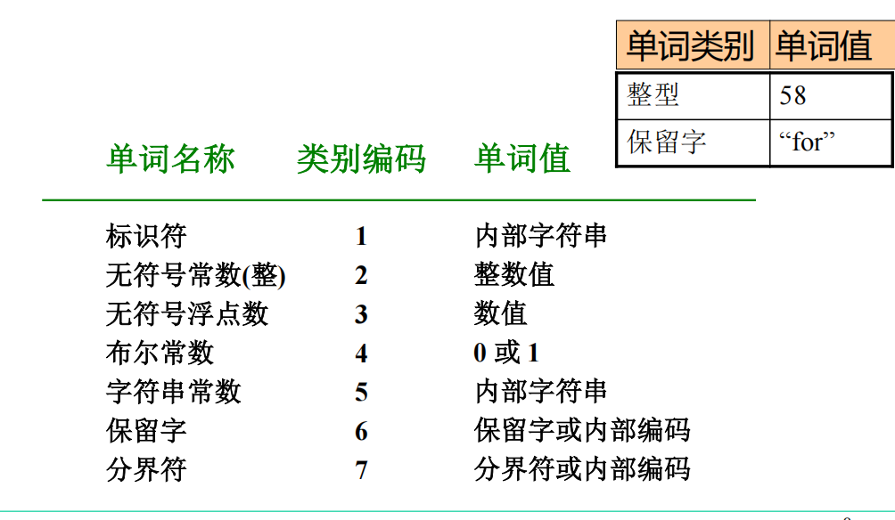
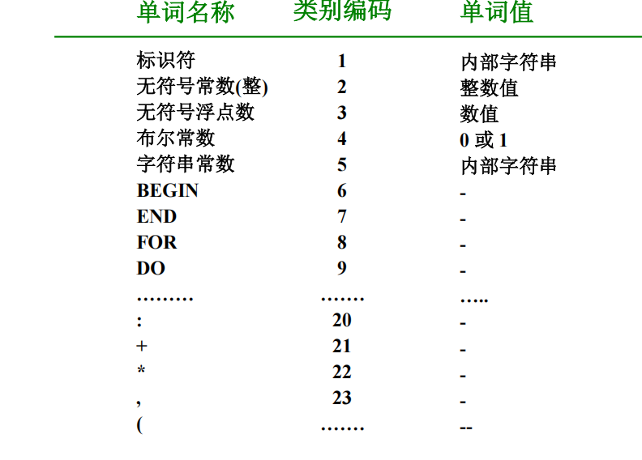
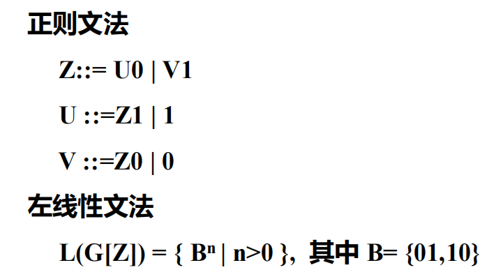
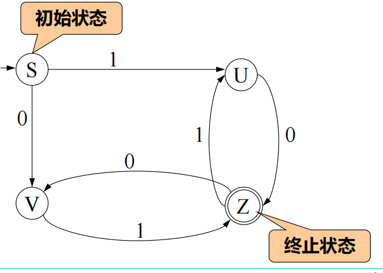
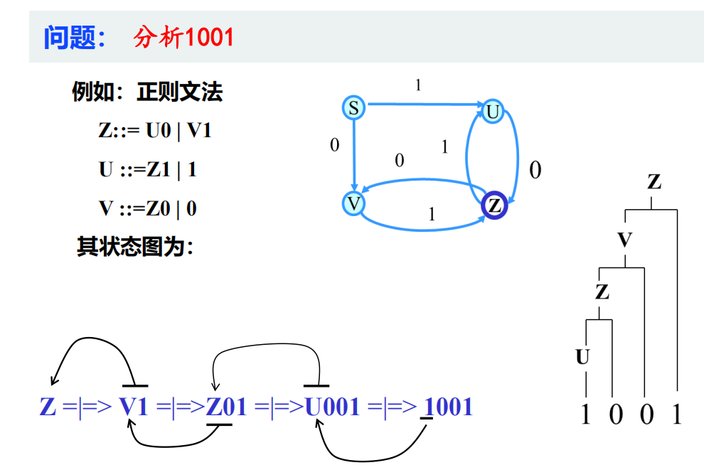
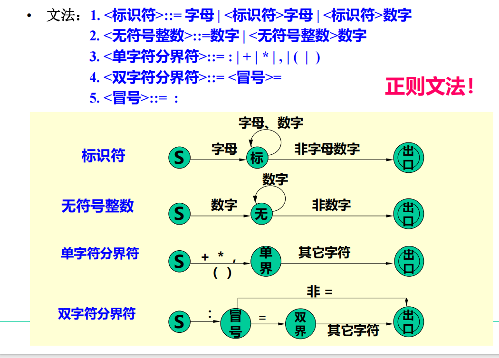

# 一、词法分析程序的功能及实现方案

## 1.1 词法分析程序的功能

* 词法分析：根据词法规则识别及组合单词，进行词法检查
* 对数字常数完成数字字符串到(二进制)数值的转换
* 删去空格字符和注解

## 1.2 实现方案

1. 词法分析单独作为一遍

​    优点：结构清晰、各遍功能单一
​    缺点：效率低

2. 词法分析程序作为单独的子程序

# 二、单词的种类及词法分析程序的输出形式

## 2.1 单词的种类

1. 保留字：begin、end、for、do
2. 标识符
3. 常数：无符号数、布尔常数、字符串常数等
4. 分界符：+、-、*、/

## 2.2 词法分析程序的输出形式——单词的内部形式

几种常用的单词内部形式：

1. 按单词种类分类
2. 保留字和分界符采用一符一类
3. 标识符和常数的单词值可为指示字(指针值)

### 2.2.1 按单词种类分类

### 2.2.2 保留字和分界符采用一符一类

# 三、正则文法和状态图

## 3.1 状态图的画法

左线性文法状态图的画法：

1. 令G的每个非终结符都是一个状态
2. 设一个开始状态S
3. 若Q::=t，$Q\in V_n,t\in V_t$，则$Q\overset{t}\leftarrow S$ 
4. 若Q::=Rt，$Q、R\in V_n,t\in V_t$，则：$Q\overset{t}\leftarrow R$
5. 按自动机方法，可加上开始状态和终止状态

## 3.2 识别算法

1. 置初始状态为当前状态，从x的最左字符开始，重复步骤2，直到x右端为止

2. 扫描x的下一个字符，在当前状态所射出的弧中找出标记有该字符的弧，并沿此弧过度到下一个状态

    如果找不到标有该字符的弧，那么x不是句子，过程到此结束

    如果扫描的是x的最右端字符，并从当前状态出发沿着标有该字符的弧过渡到下一个状态为终止状态Z，则x是句子

> [!NOTE]
>
> 1. 上述分析过程是自底向上分析
>
> 2. 怎样确定句柄？
>
>     

# 四、词法分析程序的设计与实现

词法规则$\Rightarrow$状态图$\Rightarrow$词法分析程序

## 4.1 文法及其状态图

语言的单词符号：

* 标识符
* 保留字(标识符的子集)
* 无符号整数
* 单分界符
* 双分界符

> [!NOTE]
>
> 1. 注释符号`/*`和`*\`以及//，词法分析程序不输出注释
> 2. 各单词之间用空白符号分开

