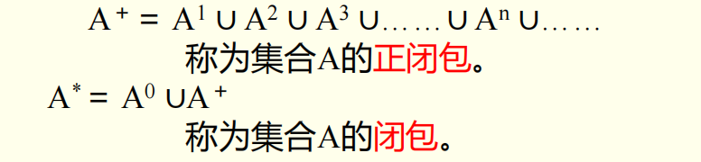
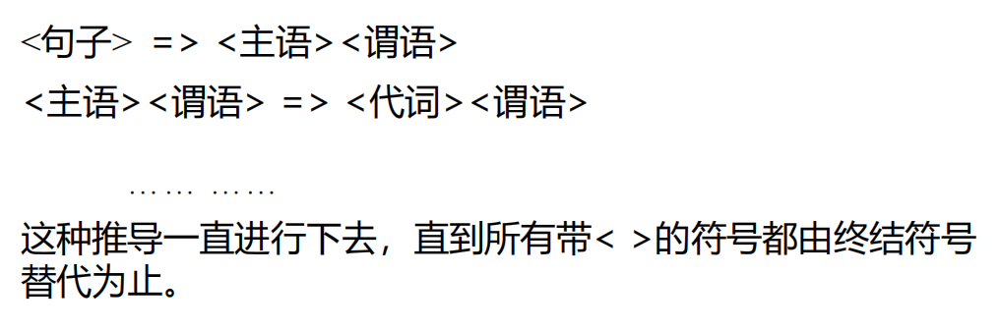
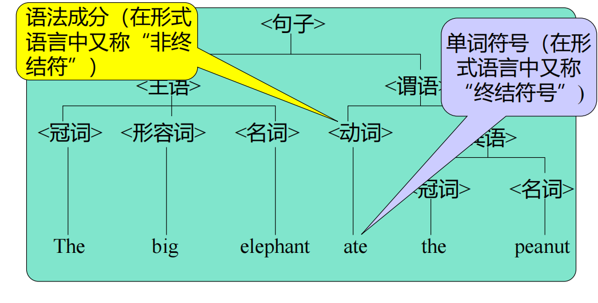
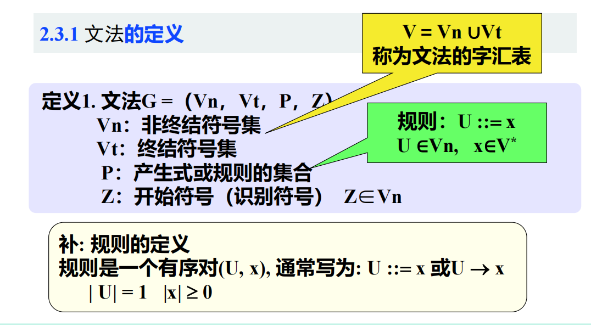
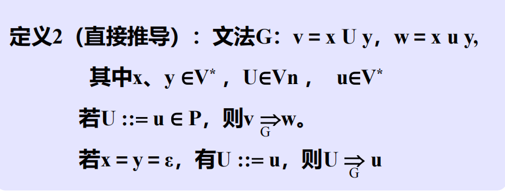
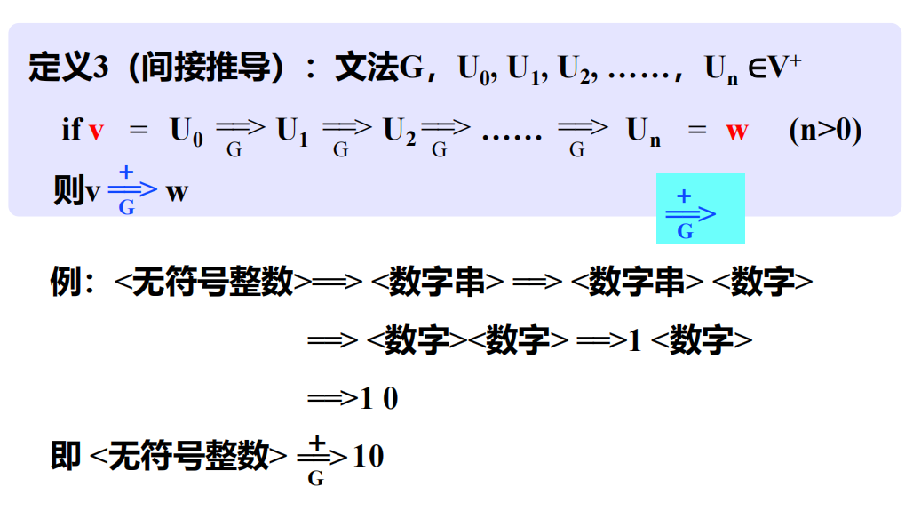
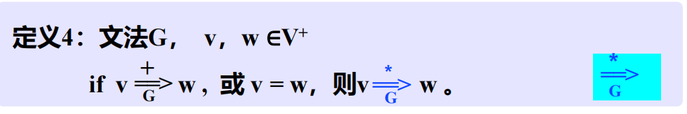
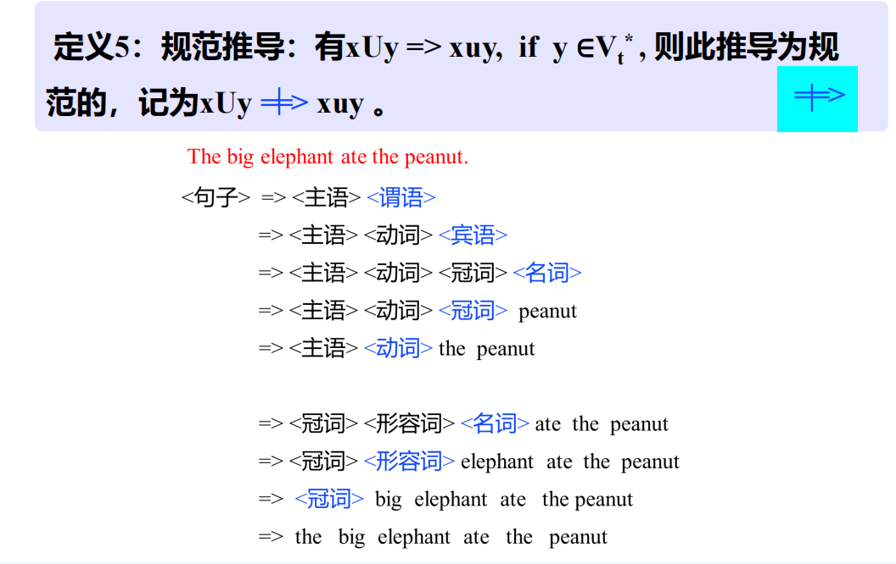

# 一、预备知识——形式语言基础

## 1.1 字母表和符号串

* 字母表：符号的非空有限集
* 符号：字母表中的元素
* 符号串：符号的有穷序列
* 空符号串：无任何符号的符号串
* 符号串集合：由符号串构成的集合

## 1.2 符号串和符号串集合的运算

1. 符号串相等：若x、y是集合上的两个字符串，则x=y当且仅当组成x的每一个符号和组成y的每一个符号依次相等
2. 符号串的长度：x为符号串，其长度|x|等于组成该符号串的符号个数
3. 符号串的联接：若x、y是定义在$\sum$上的符号串，且x=XY，y=YX，则x和y的联接xy=XYYX也是$\sum$上的符号串
4. 符号串集合的乘积运算：AB＝{ xy |x∈A, y∈B}
5. 符号串集合的幂运算：$A^0$={ε},…..$A^n$=$A^{n-1}$A=A$A^{n-1}$
6. 符号串集合的闭包运算：

# 二、文法的非形式讨论

1. 文法：对语言结构的定义与描述，即从形式上用于描述和规定语言结构的称为文法或语法

2. 语法规则：通过建立一组规则，来描述句子的语法结构。规定用“::=”表示“由……组成”

3. 由规则推导句子：有了一组规则之后，可以按照一定的方式用他们去推导或产生句子

    推导方法：从一个要识别的符号开始推导，即用相应规则的右部来替代规则的左部，每次仅用一条规则去进行推导

    

4. 语法树：我们用语法树来描述一个句子的语法结构

# 三、文法和语言的形式定义

## 3.1 文法的定义

## 3.2 推导的形式定义

### 3.2.1 直接推导

如果当前串里出现了某个非终结符U，并且文法里有产生式U::=u，那么就可以把这个U替换成u，得到一个新的串，这个一步替换就叫直接推导

### 3.2.2 间接推导

### 3.2.3 

### 3.2.4 规范推导

直观意义：规范推导=最右推导

==最右推导==：若符号串中有两个以上的非终结符时，先推右边的

==最左推导==：若符号串中有两个以上的非终结符时，先推左边的