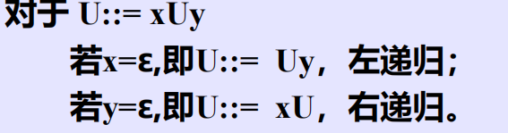
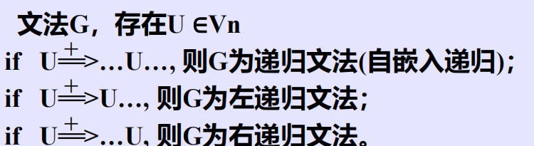
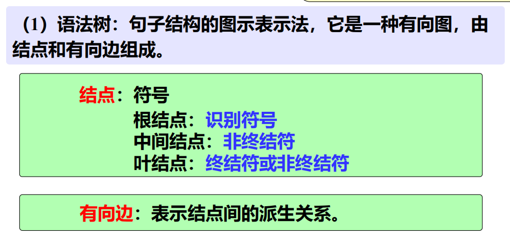
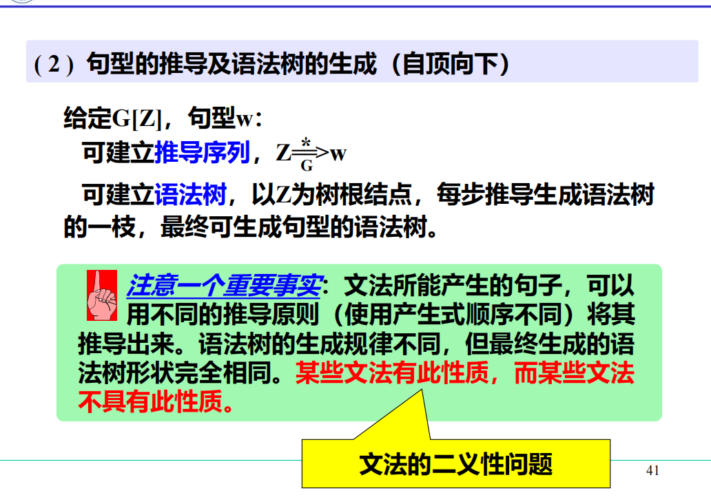

# 一、预备知识——形式语言基础

## 1.1 字母表和符号串

* 字母表：符号的非空有限集
* 符号：字母表中的元素
* 符号串：符号的有穷序列
* 空符号串：无任何符号的符号串
* 符号串集合：由符号串构成的集合

## 1.2 符号串和符号串集合的运算

1. 符号串相等：若x、y是集合上的两个字符串，则x=y当且仅当组成x的每一个符号和组成y的每一个符号依次相等
2. 符号串的长度：x为符号串，其长度|x|等于组成该符号串的符号个数
3. 符号串的联接：若x、y是定义在$\sum$上的符号串，且x=XY，y=YX，则x和y的联接xy=XYYX也是$\sum$上的符号串
4. 符号串集合的乘积运算：AB＝{ xy |x∈A, y∈B}
5. 符号串集合的幂运算：$A^0$={ε},…..$A^n$=$A^{n-1}$A=A$A^{n-1}$
6. 符号串集合的闭包运算：

# 二、文法的非形式讨论

1. 文法：对语言结构的定义与描述，即从形式上用于描述和规定语言结构的称为文法或语法

2. 语法规则：通过建立一组规则，来描述句子的语法结构。规定用“::=”表示“由……组成”

3. 由规则推导句子：有了一组规则之后，可以按照一定的方式用他们去推导或产生句子

    推导方法：从一个要识别的符号开始推导，即用相应规则的右部来替代规则的左部，每次仅用一条规则去进行推导

    

4. 语法树：我们用语法树来描述一个句子的语法结构

# 三、文法和语言的形式定义

## 3.1 文法的定义

## 3.2 推导的形式定义

### 3.2.1 直接推导

如果当前串里出现了某个非终结符U，并且文法里有产生式U::=u，那么就可以把这个U替换成u，得到一个新的串，这个一步替换就叫直接推导

### 3.2.2 间接推导

### 3.2.3 

### 3.2.4 规范推导

直观意义：规范推导=最右推导

定义中的$\boxed{y\in V_t^*}$：U是这一步准备替换的非终结符，而y是U右边的所有符号，也就是U右边只能存在终结符，不能再存在非终结符

==最右推导==：若符号串中有两个以上的非终结符时，先推右边的

==最左推导==：若符号串中有两个以上的非终结符时，先推左边的

## 3.3 语言的形式定义

> [!IMPORTANT]
>
> 文法G[Z]
>
> 1. 句型：x是句型 $\Leftrightarrow$ Z$\overset{*}\Rightarrow$x，且$x\in V^*$
> 2. 句子：x是句子 $\Leftrightarrow$ $Z\overset{+}\Rightarrow x$，且$x\in V_t{^*}$
> 3. 语言：$L(G[Z])= \{x|x\in V_t^*,Z\overset{+}\Rightarrow x\}$

> [!IMPORTANT]
>
> G和$G^‘$是两个不同的文法，若L(G)=L(G’),则它们为`等价文法`

## 3.4 递归文法

### 3.4.1 递归规则

规则右部有与左部相同的符号

### 3.4.2 递归文法

* 左递归文法的缺点：不能用自顶向下的方法来进行语法分析
* 递归文法的优点：可用有穷条规则，定义无穷语言

## 3.5 句型的短语、简单短语和句柄

> [!IMPORTANT]
>
> 给定文法$G[Z]$，$w=xuy\in V^+$，为该文法的句型
>
> ​	若$Z\overset{*}\Rightarrow xUy$，且$U\overset{+}\Rightarrow u$，则u是句型w相对于U的短语
>
> ​	若$Z\overset{*}\Rightarrow xUy$，且$U\Rightarrow u$，则u是句型w相对于U的简单短语
>
> 其中$U\in V_n$，$u\in V^+$，$x,y\in V^*$

直观理解：短语是前面句型句型中的某个非终结符所能推出的符号串

> 任何句型本身一定是相对于识别符号Z的短语

> [!IMPORTANT]
>
> 任一句型的最左简单短语称为该句型的句柄

当一个句型有多个简单短语时，需要在规范推导(最右推导)中，最后一步产生出来的那个简单短语

# 四、语法树与二义性文法

## 4.1 推导与语法树

> [!IMPORTANT]
>
> 子树与短语
>
> 子树：语法树中的某个结点(子树的根)连同它向下派生的部分所组成

某子树的末端节点按自左向右顺序为句型中的符号串，则该符号串为该句型的相对于该子树根的短语

4. 树与推导

    自下而上地修剪子树的末端结点，直至把整颗树剪掉，每剪一次对应一次规约

    从句型开始，自左向右地逐步进行规约，建立推导序列

    > [!IMPORTANT]
    >
    > `规范规约`：对句型中最左简单短语(句柄)进行的规约称为规范规约

通常我们每次都要剪掉当前句型的句柄，即每次均进行规范规约

规范句型：通过规范推导或规范规约所得到的句型

## 4.2 文法的二义性

1. 若对于一个文法的某一句子存在两颗不同的语法树，则该文法是二义性文法

    也就是说，无二义性文法的句子只有一个语法树

2. 若一个文法的某句子存在两个不同的规范推导，则该文法是二义性的

3. 若一个文法的某规范句型的句柄不唯一，则该文法是二义性的

> [!NOTE]
>
> 若文法是二义性的，则在编译时就会产生不确定性
>
> 遗憾的是在理论上已经证明：文法的二义性是不可判定的

