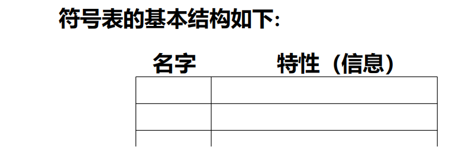
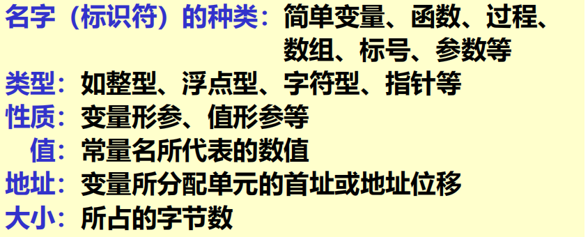
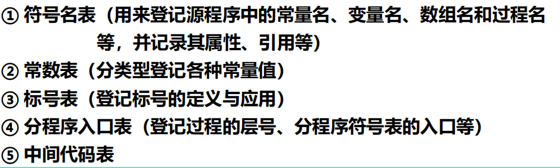
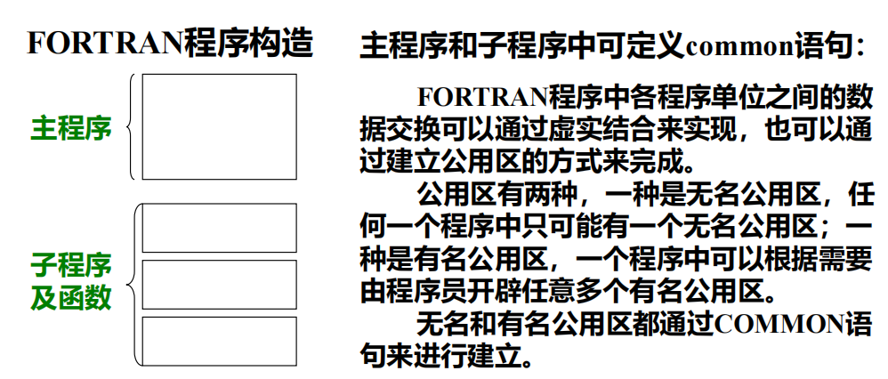
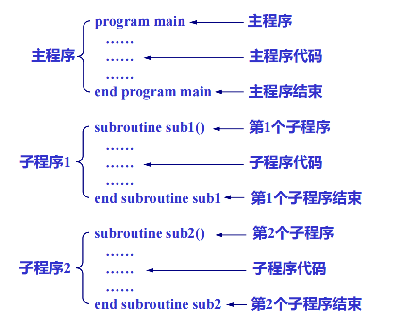
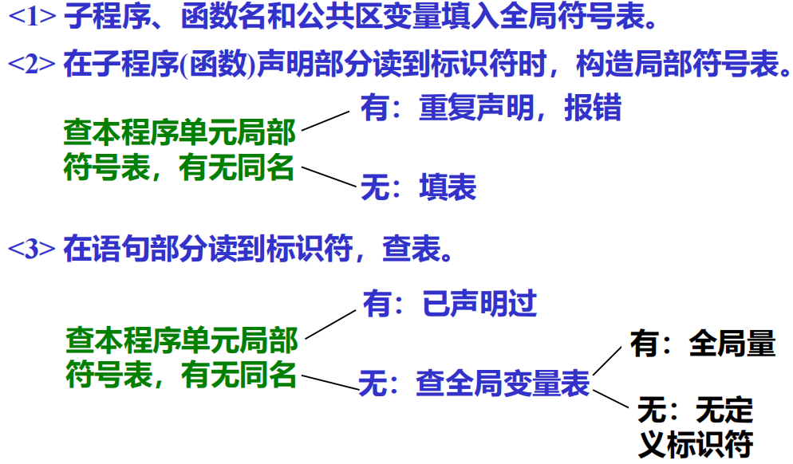

# 一、概述

## 1.1 符号表定义

在编译过程中，编译程序用来记录源程序中各种名字的特性信息，也称为名字特性表

* 名字：程序名、过程名、函数名、用户定义类型名、变量名、常量名、枚举值名、标号名等
* 特性信息：上述名字的种类、类型、维数、参数个数及目标地址等

## 1.2 建表和查表的必要性

- 源程序中变量要先声明，然后才能引用
- 编译程序遇到用户的声明语句时，应该将声明中的名字以及信息登录到符号表，同时编译程序还要给变量分配存储单元
- 存储单元地址也必须登录在符号表中
- 编译程序编译到引用所声明的变量时，要进行语法语义正确性检查和生成相应的目标程序，需要查符号表以取得相关信息

## 1.3 填表和查表

- **填表**：当分析到程序中的声明或定义语句时，应将声明或定义的名字以及与之有关的信息填入符号表中
- **查表**：
    - 填表前查表，检查在程序的同一作用域内名字是否重复定义
    - 检查名字的种类是否与声明一致
    - 对于强类型语言，要检查表达式中各变量的类型是否一致
    - 生成目标指令时，要取得所需要的地址

# 二、符号表的组织和内容

## 2.1 符号表的结构与内容

- 名字域：存放名字，一般为标识符的符号串，也可为指向标识符字符串的指针
- 特性域：可包括多个子域，分别表示标识符的有关信息

作用域的嵌套层次：

- 对于数组：维数、上下界值、计算下标量地址所用的信息以及数组元素类型等
- 对于记录(结构、联合)：域的个数，每个域名、地址位移、类型等
- 对于过程或函数：形参个数、所在层次、函数返回值类型、局部变量所占空间大小等
- 对于指针：所指对象类型等

## 2.2 符号表的组织方式

1. 统一符号表：不论什么名字都填入统一格式的符号表中

    符号表表项应按信息量最大的名字设计。填表、查表比较方便，结构简单，但是浪费大量空间

2. 对于不同种类的名字分别建立各种符号表

    节省空间，但是填表和查表不方便

    

3. 折中办法：大部分共同信息组成统一格式的符号表，特殊信息另设附表，两者用指针连接

## 三、非分程序结构语言的符号表组织

## 3.1 非分程序的结构语言

每个可独立进行编译的程序单元是一个不包含有子模块的单一模块

## 3.2 标识符的作用域及基本处理方法

1. 作用域：

    ​	全局：子程序名、函数名和公开区名

    ​	局部：程序单元中定义的变量

2. 符号表的组织：全局符号表+局部符号表

3. 基本处理方法：

## 3.3 符号表的组织方式