# 一、概述

## 1.1 符号表定义

在编译过程中，编译程序用来记录源程序中各种名字的特性信息，也称为名字特性表

* 名字：程序名、过程名、函数名、用户定义类型名、变量名、常量名、枚举值名、标号名等
* 特性信息：上述名字的种类、类型、维数、参数个数及目标地址等

## 1.2 建表和查表的必要性

- 源程序中变量要先声明，然后才能引用
- 编译程序遇到用户的声明语句时，应该将声明中的名字以及信息登录到符号表，同时编译程序还要给变量分配存储单元
- 存储单元地址也必须登录在符号表中
- 编译程序编译到引用所声明的变量时，要进行语法语义正确性检查和生成相应的目标程序，需要查符号表以取得相关信息

## 1.3 填表和查表

- **填表**：当分析到程序中的声明或定义语句时，应将声明或定义的名字以及与之有关的信息填入符号表中
- **查表**：
    - 填表前查表，检查在程序的同一作用域内名字是否重复定义
    - 检查名字的种类是否与声明一致
    - 对于强类型语言，要检查表达式中各变量的类型是否一致
    - 生成目标指令时，要取得所需要的地址

# 二、符号表的组织和内容

## 2.1 符号表的结构与内容

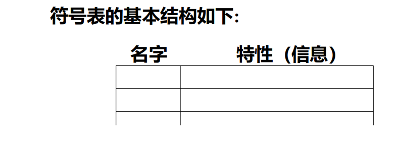

- 名字域：存放名字，一般为标识符的符号串，也可为指向标识符字符串的指针
- 特性域：可包括多个子域，分别表示标识符的有关信息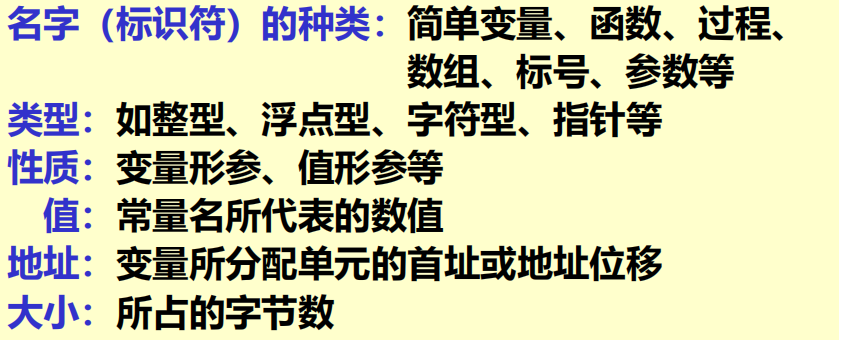

作用域的嵌套层次：

- 对于数组：维数、上下界值、计算下标量地址所用的信息以及数组元素类型等
- 对于记录(结构、联合)：域的个数，每个域名、地址位移、类型等
- 对于过程或函数：形参个数、所在层次、函数返回值类型、局部变量所占空间大小等
- 对于指针：所指对象类型等

## 2.2 符号表的组织方式

1. 统一符号表：不论什么名字都填入统一格式的符号表中

    符号表表项应按信息量最大的名字设计。填表、查表比较方便，结构简单，但是浪费大量空间

2. 对于不同种类的名字分别建立各种符号表

    节省空间，但是填表和查表不方便

    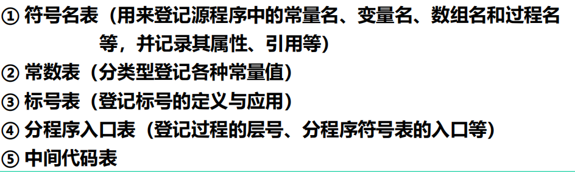

3. 折中办法：大部分共同信息组成统一格式的符号表，特殊信息另设附表，两者用指针连接

# 三、非分程序结构语言的符号表组织

## 3.1 非分程序的结构语言

每个可独立进行编译的程序单元是一个不包含有子模块的单一模块

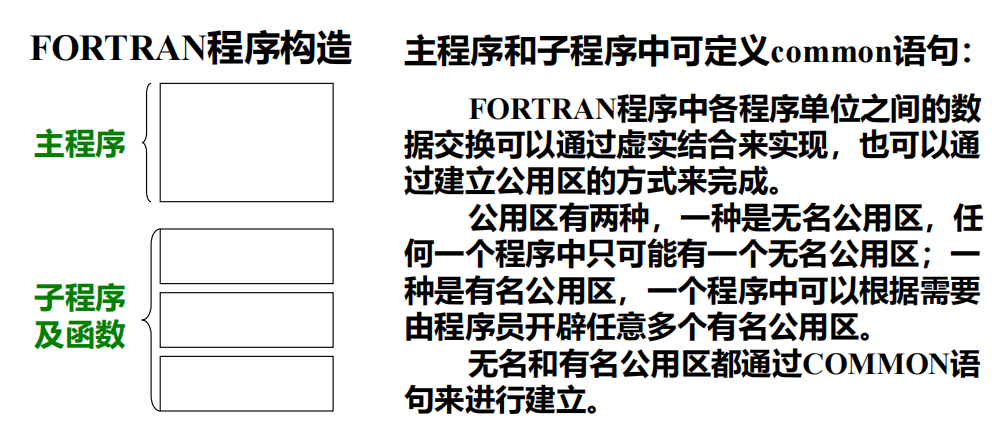

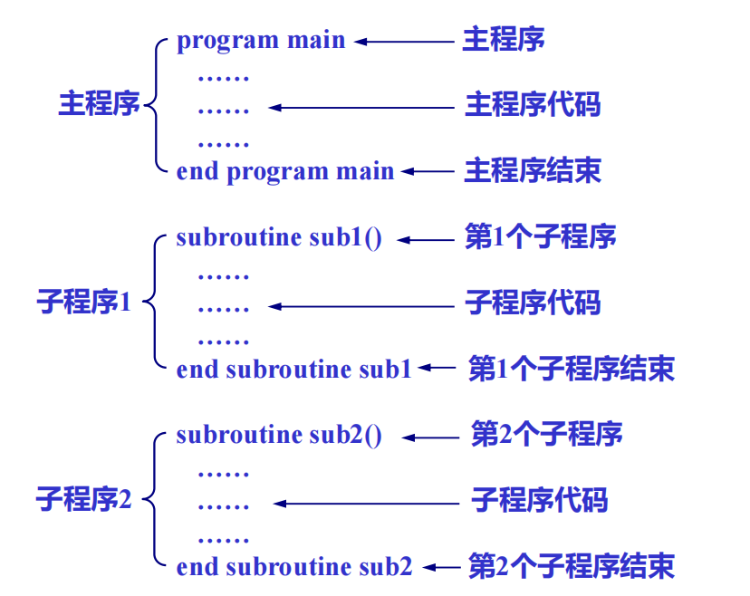

## 3.2 标识符的作用域及基本处理方法

1. 作用域：

    ​	全局：子程序名、函数名和公开区名

    ​	局部：程序单元中定义的变量

2. 符号表的组织：全局符号表+局部符号表

3. 基本处理方法：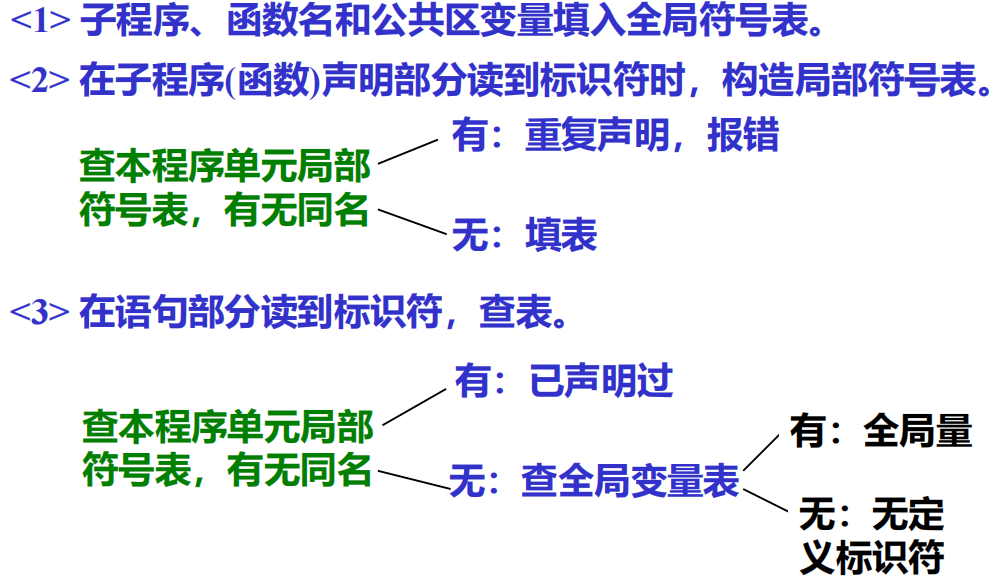

## 3.3 符号表的组织方式

1. 无序符号表——按扫描顺序建表，查表需要逐项查找

   查表操作的平均长度为$$\frac{n+1}{2}$$

2. 有序符号表：符号表按变量名进行字典式排序

   线性查表：$$\frac{n+1}{2}$$

   折半查表：$$log_2n-1$$

3. 散列符号表(Hash表)：

   符号表地址=Hash(标识符)

# 四、分程序结构语言的符号表组织

1. 分程序的结构语言：模块内可嵌入子模块
2. 标识符的作用域和基本处理方法
   - 作用域：标识符局部于所定义的模块

## 4.1 作用域

### 1. 模块中所定义标识符的作用域是定义该标识符的子程序

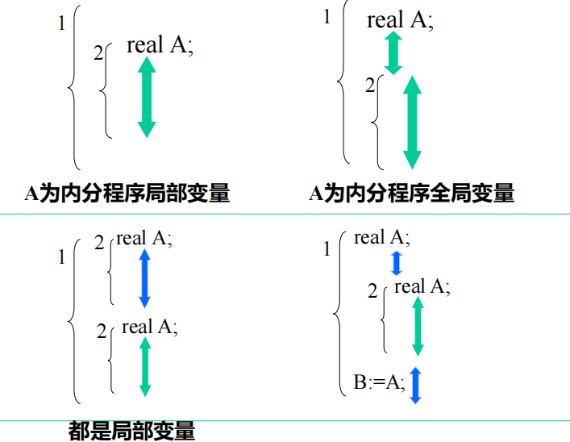

### 2. 过程或函数声明中定义的标识符(包括形参)其作用域为本过程体

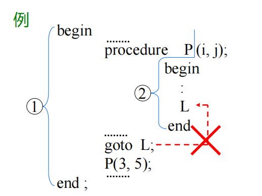

### 3. 循环语句中定义的标识符，其作用域为该循环语句

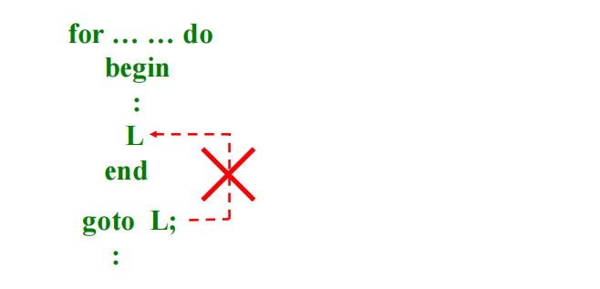

不能从循环体外转到循环体内，循环语句应看作一层

## 4.2 基本处理方法

> 建查符号表均要遵循标识符作用域规定进行
>
> 建表：不能重复，不能遗漏
>
> 查表：按标识符作用域查找

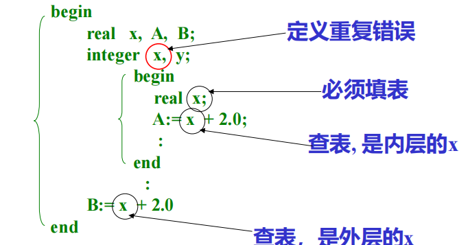

### 分程序的处理方法

假设标识符是先声明后引用(标号例外，要特殊处理)

1. 在程序声明部分读到标识符时(声明性出现)建表：

   查本层符号表，有无同名，有就报错，无就填入符号表

2. 在语句中读到标识符(引用性出现)，查表：

   查本层符号表，有无同名，有就是已声明，无转到直接外层去寻找

### 非分程序的处理方法

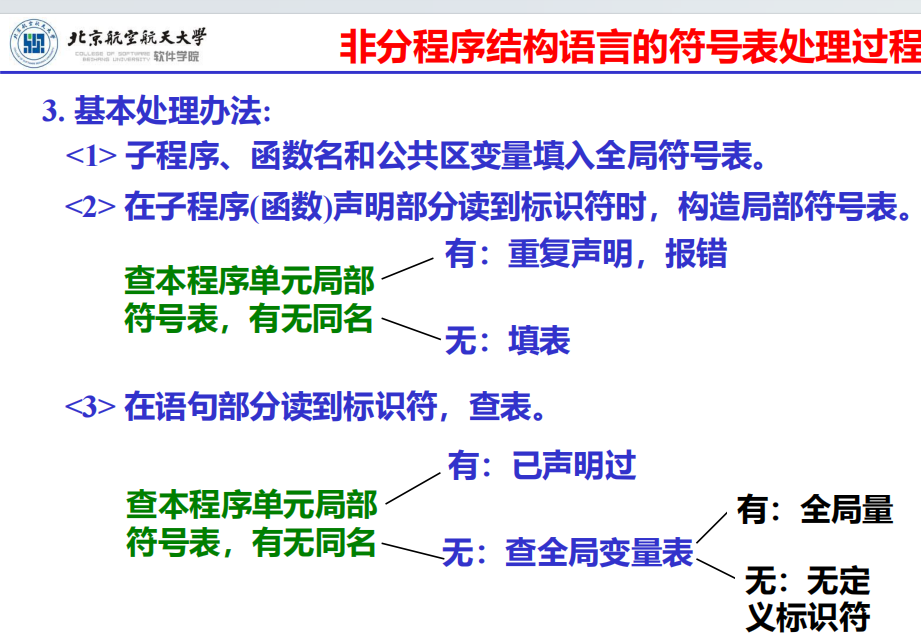

## 4.3 分程序符号表的组织方式

1. 分层组织符号表的登记项

   各分程序符号表登记项按照语法识别顺序连续排列在一起，不为其内层分程序的符号表登记项所割裂

2. 用"分程序表"索引各分程序符号表的信息

   分程序表中的各登记项是自左至右扫描源程序的过程中，按分程序出现的顺序依次填入的，且对每一个分程序填写一个登记项

   分程序登记项序号隐含地表征各分程序的编号

## 4.4 分程序表结构

| OUTERN | ECOUNT | POINTER |
| ------ | ------ | ------- |

其中：

- OUTERN——指明该分程序的直接外层分册程序的编号
- ECOUNT——记录该分程序符号表登记项的个数
- POINTER——指向该分程序符号表的起始位置

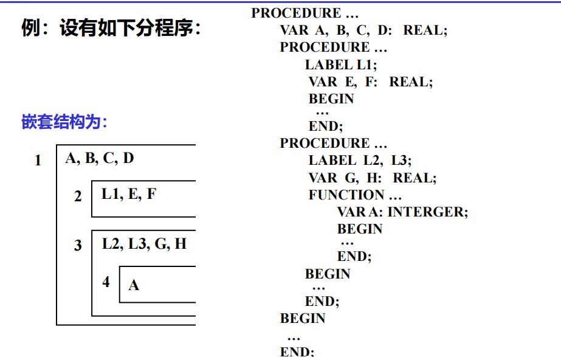

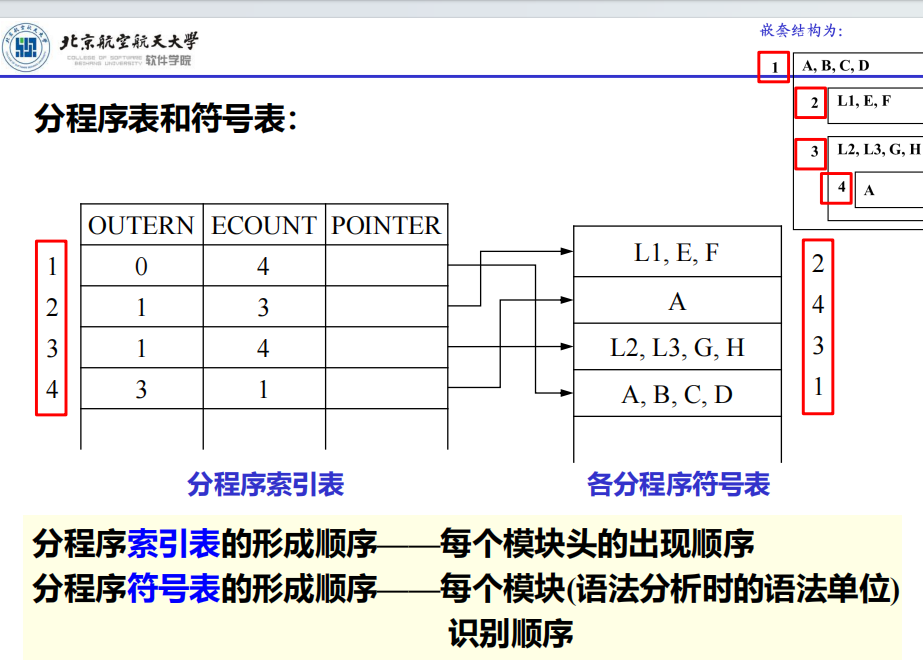

> 本例子中，分程序符号表的形成顺序为2，4，3，1，这个次序是关闭分程序的次序，END出现的次序

扫描过程：

进入1：压入1
进入2：压入2
2结束：弹出2 → 形成符号表2

进入3：压入3
进入4：压入4
4结束：弹出4 → 形成符号表4
3结束：弹出3 → 形成符号表3

1结束：弹出1 → 形成符号表1

所以最后的符号表呈现的就是2->4->3->1的顺序
