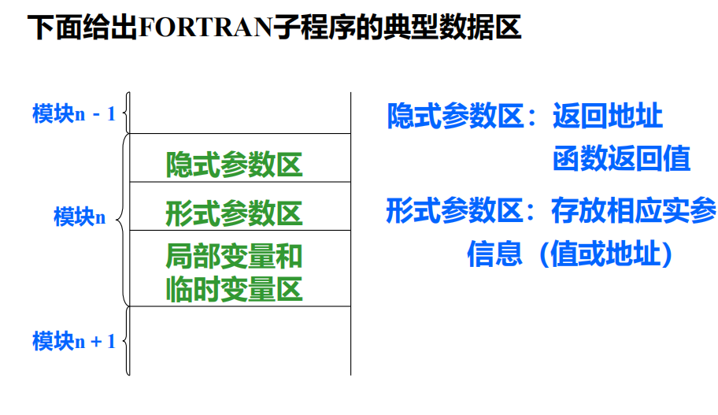
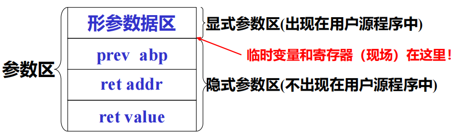
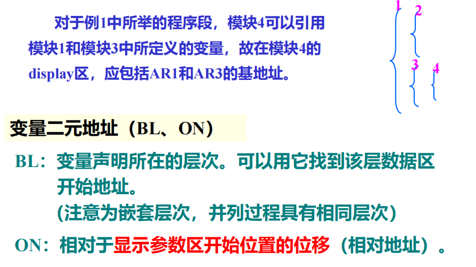

# 一、概述

## 1.1 运行时的存储组织及管理

​	目标程序运行时所需要存储空间的组织与管理以及源程序中变量存储空间的分配

## 1.2 静态存储分配和动态存储分配

- 静态存储分配：在编译阶段由编译程序实现对存储空间的管理，和为源程序中的变量分配存储的方法
- 条件：如果在编译时能够确定源程序中变量在运行时的数据空间大小，且运行时不改变，那么就可以采用静态存储分配方法
- 动态存储分配：在目标程序运行阶段由目标程序实现对存储空间的组织与管理，和为源程序中的变量分配存储的方法
- 特点：在目标程序运行时进行分配；编译时要生成进行动态分配的目标指令

# 二、静态存储分配

## 2.1 分配策略

​	由于每个变量所需空间的大小在编译时已知，因此可以用简单的方法给变量分配目标地址

- 开辟一数据区(首地址在加载时确定)
- 按编译顺序给每个模块分配
- 在模块内部按顺序给模块的变量分配存储，一般用相对地址，所占数据区的大小由变量类型确定

> [!NOTE]
>
> 这种分配策略要求语言不允许指针或动态分配，不允许递归调用过程。典型的例子是Fortran77

## 2.2 模块(FORTRAN子程序)的完整数据区

​	编译程序除了要给源程序中的各种变量分配数据区以外，对子程序来说还要在数据区中保留返回地址，对形式参数也要分配存储以存放相应的实参的信息，另外要在编译时还要分配临时变量空间(如存放表达式计算的中间结果等)

# 三、动态存储分配

​	对于分程序结构，而且允许递归调用的语言，常使用栈式动态存储分配，即使用一个类似于堆栈的运行栈来实现数据区的分配

分配策略是：整个数据区为一个堆栈

1. 当进入一个过程时，在栈顶为其分配一个数据区
2. 当退出一个过程时，撤销该过程的数据区

## 3.1 活动记录

一个典型的活动记录可以分为三部分

| 局部数据区 |
| ---------- |
| 参数区     |
| display区  |

### 1. 局部数据区

存放模块中定义的各个局部变量

### 2. 参数区

存放隐式参数和显式参数

- `prev abp`：存放调用模块记录基地址。函数执行完时，释放其数据区，数据区指针指向调用前的位置
- `ret addr`：返回地址，即调用语句的下一条执行指令地址
- `ret value`：函数返回值(无值则空)
- 形参数据区：每一形参都要分配数据空间，形参单元中存放实参值或实参地址

### 3. display区

存放各外层模块活动记录的基地址

