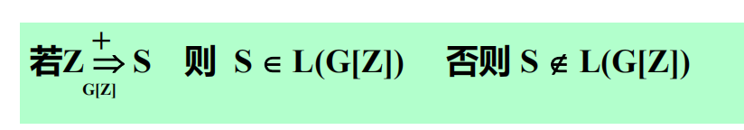
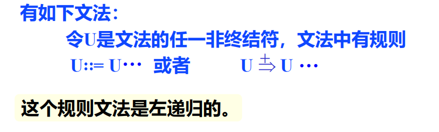
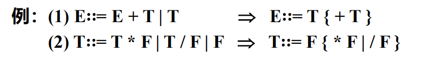
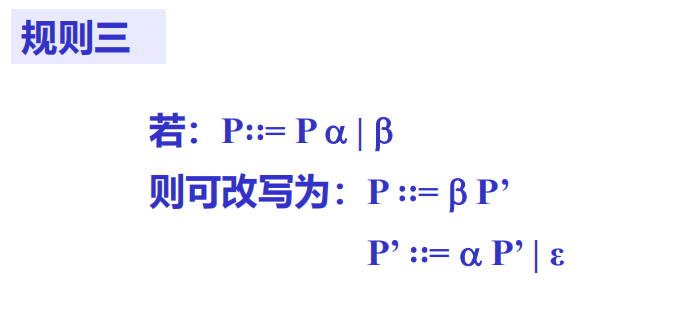

# 一、语法分析概述

* **功能**：根据文法规则，从源程序单词符号串中识别出语法成分，并进行语法检查
* **基本任务**：识别符号串S是否为某语法成分
* **两大分析方法**：自顶向下分析、自底向上分析

# 二、自顶向下分析

存在主要问题：

- 左递归问题
- 回溯问题

自顶向下分析方法的特点：

1. 分析过程是带有预测的，即要根据输入符号串中下一个单词，来预测之后的内容属于什么语法成分，然后用相应语法成分的文法建立语法树
2. 分析过程是一种`试探过程`，是尽一切办法设法建立语法树的过程，分析过程需要进行回溯
3. 最左推导可以编出程序来实现，但在实际上价值不大，效率低，代价高

## 2.1 自顶向下分析存在的问题及解决方法

### 2.1.1 左递归文法

该方法的基本缺点是不能处理具有左递归的文法

解决办法：消除直接左递归

#### 方法一：使用扩充的BNF表示来改写文法

#### 方法二：将左递归规则改为右递归规则

### 2.1.2 回溯问题

